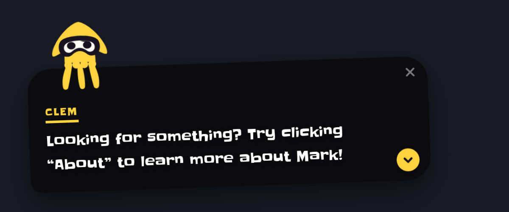

# dialogue-squid

Meet **Clem**! A video game-style dialogue popup for React. Clem pops up at the bottom of the
page 2.5seconds after load, perches on top of his own dialogue box, and tells your visitors
where to click. I was inspired by my endless love of Nintendo games, and early 2000's era Microsoft Word helpers.



No runtime dependencies beyond React. 13 kB of JS (4 kB gzipped), one stylesheet, one
hand-drawn SVG.

---

## Install

```bash
npm install github:marktoadvine/dialogue-squid
```

```tsx
import { ClemDialogue } from 'dialogue-squid'
import 'dialogue-squid/styles.css'

export function App() {
  return <ClemDialogue messages={['Hi! I am Clem.']} />
}
```

That's the whole integration. React `>=18` is the only peer dependency.

---

## How it works

Drop him in once, near the root of your app, and he handles himself:

1. **Nothing renders for the first 2.5 seconds.** He arrives after the page has settled,
   so he reads as noticing your visitor rather than as part of the load.
2. **He pops up at the bottom centre** of the screen and types out his first line.
3. **Click the panel to move through the lines.** If a line is still typing, the first
   click finishes it; the next click moves on. Same as a game dialogue box.
4. **After the last line he closes.** The ✕ or the `Escape` key dismisses him at any point.
5. **If you give him an `idleNudge`, he comes back on his own** after a quiet stretch.

He is not a modal. He never blocks the page, never traps the keyboard, and never steals
focus — a visitor can ignore him completely and nothing is in their way.

---

## Changing what he says

This is the part you'll actually touch. Every line is one item in `messages`, and he
speaks them in order.

### The basics

A plain string is a line:

```tsx
<ClemDialogue
  messages={[
    'Looking for something? Try clicking “About” to learn more about Mark!',
    'That little arrow means there is more to read.',
    'Squid fact: I have three hearts.',
  ]}
/>
```

### Give him an expression

Swap a string for an object to set his face. There's no mouth — the whole eye mask changes
shape instead.

```tsx
<ClemDialogue
  messages={[
    { text: 'Psst — over here!', mood: 'curious' },
    { text: 'Told you it was worth a look.', mood: 'sly' },
    { text: 'That is all I had.', mood: 'happy' },
  ]}
/>
```

| Mood | |
| --- | --- |
| `idle` | Neutral. The default. |
| `curious` | One brow up. |
| `excited` | Wide-eyed. |
| `sly` | Half-lidded, eyes open — the smirk. |
| `happy` | Eyes closed, two upward arcs — the cheeky one. |

### Add a button

Any message can carry one. Use `href` for a link, `onClick` for anything else.

```tsx
<ClemDialogue
  messages={[
    {
      text: 'Want the whole story?',
      mood: 'excited',
      action: { label: 'Read the About page', href: '/about' },
    },
  ]}
/>
```

### Rename him

```tsx
<ClemDialogue name="SQUIDLY" messages={['New name, same squid.']} />
```

### Change the timing

```tsx
<ClemDialogue
  messages={['Faster, and sooner.']}
  appearDelayMs={800}
  typeSpeed={16}
/>
```

| Prop | Default | |
| --- | --- | --- |
| `appearDelayMs` | `2500` | How long before he first shows. `0` shows him immediately. |
| `typeSpeed` | `28` | Milliseconds per character. Lower is faster. |
| `autoAdvanceMs` | `null` | Move to the next line on a timer instead of waiting for a click. |

### Have him pipe up on his own

```tsx
<ClemDialogue
  messages={['Welcome!']}
  idleNudge={{
    after: 12000,
    messages: ['Hey! Still there? Take your time.'],
    repeat: true,
  }}
/>
```

After 12 seconds of no interaction he reappears with those lines. Any interaction resets
the countdown. Without `repeat: true` he nudges once and then leaves the visitor alone.

---

## Driving him from your app

By default Clem manages his own visibility. If you want to control it — show him on one
page, or after something happens — pass `open` and keep it in state:

```tsx
const [open, setOpen] = useState(false)

return (
  <>
    <button onClick={() => setOpen(true)}>Ask Clem</button>
    <ClemDialogue open={open} onOpenChange={setOpen} messages={['You rang?']} />
  </>
)
```

Pass `open` and you own it; omit it and he handles himself. `onMessageChange` and
`onAction` are there if you want to react to where he's got to.

---

## Making him fit your site

### Colours and sizing

Every colour, size and timing is a CSS custom property. The `className` prop lands on the
element that declares them, so that's your way in:

```tsx
<ClemDialogue className="clem-mint" messages={lines} />
```

```css
/* A plain global stylesheet. The component's own class names are hashed by
   CSS Modules, so your own class is the stable hook. */
.clem-mint {
  --clem-body: #8ef0c4;
  --clem-accent: #8ef0c4;
  --clem-panel: rgb(18 8 30 / 0.92);
}
```

| Variable | Default | |
| --- | --- | --- |
| `--clem-body` | `#ffd23f` | All of Clem. One flat colour, no shading |
| `--clem-ink` | `#16121f` | His eye mask and pupils |
| `--clem-accent` | `#ffd23f` | Name, chevron, caret, buttons |
| `--clem-text` | `#ffffff` | Message text |
| `--clem-panel` | `rgb(10 10 12 / 0.9)` | The bubble |
| `--clem-panel-blur` | `3px` | Backdrop blur behind the bubble |
| `--clem-font` | `'Slackey', …` | Typeface for the whole component |
| `--clem-z` | `9999` | Stacking order |
| `--clem-offset` | `clamp(0.75rem, 3vw, 2rem)` | Distance from the viewport edges |
| `--clem-size` | `88px` | Clem's height |
| `--clem-perch` | `30px` | How far his tentacles dangle over the panel |
| `--clem-headroom` | `2.35rem` | Top padding the tentacles hang into |

`--clem-perch` and `--clem-headroom` move together. The headroom is the band of padding his
tentacles hang into; push the perch past it and they land on top of his name.

### Which corner he sits on

```tsx
<ClemDialogue side="right" messages={lines} />
```

The panel is always centred at the bottom of the viewport. `side` moves Clem from one end
of its top edge to the other, and takes the dismiss button with him to the opposite corner.

### The font

Clem is set in [Slackey](https://fonts.google.com/specimen/Slackey). It is **optional** —
without it he falls back to a rounded system stack and nothing breaks. To get the real
thing, install it and import it once in your app entry:

```bash
npm install @fontsource/slackey
```

```tsx
import '@fontsource/slackey'
```

Self-hosted, so there's no CDN request. Prefer a different face? Skip the install and set
`--clem-font` instead. Note that Slackey ships a single weight, so hierarchy inside the
panel comes from size and colour rather than bold-vs-regular — worth knowing if you restyle
it.

---

## Props

| Prop | Type | Default | What it does |
| --- | --- | --- | --- |
| `messages` | `Array<string \| ClemMessage>` | — | The queue. Plain strings get the default mood. |
| `open` | `boolean` | — | Controlled visibility. Omit to let Clem manage himself. |
| `defaultOpen` | `boolean` | `true` | Initial visibility when uncontrolled. |
| `onOpenChange` | `(open: boolean) => void` | — | Fires whenever he opens or closes. |
| `onDismiss` | `() => void` | — | Fires when he's dismissed specifically. |
| `onMessageChange` | `(index: number, message: ClemMessage) => void` | — | Fires as the queue advances. |
| `onAction` | `(message: ClemMessage) => void` | — | Fires when a message's action is clicked. |
| `name` | `string` | `'CLEM'` | The label above the message. |
| `appearDelayMs` | `number` | `2500` | Wait before his first appearance. `0` disables. |
| `typeSpeed` | `number` | `28` | Milliseconds per character. |
| `side` | `'left' \| 'right'` | `'left'` | Which corner of the panel Clem perches on. |
| `autoAdvanceMs` | `number \| null` | `null` | Auto-advance this long after a line lands. |
| `idleNudge` | `ClemIdleNudge \| null` | `null` | Have him pipe up after a quiet stretch. |
| `className` | `string` | — | Applied to the outermost element. |

```ts
type ClemMood = 'idle' | 'curious' | 'excited' | 'sly' | 'happy'

interface ClemMessage {
  id?: string
  text: string
  mood?: ClemMood
  action?: {
    label: string
    onClick?: () => void
    href?: string      // renders a link instead of a button
  }
}

interface ClemIdleNudge {
  after: number        // ms of quiet before he speaks up
  messages: Array<string | ClemMessage>
  repeat?: boolean     // defaults to false — nudge once, then stop
}
```

---

## Framework notes

**Astro** — CSS Modules work natively (Astro runs on Vite), so he drops in as an island
with no extra config:

```astro
---
import { ClemDialogue } from 'dialogue-squid'
import 'dialogue-squid/styles.css'
---
<ClemDialogue client:visible messages={["Looking for something?"]} />
```

**Next.js (App Router)** — nothing to do. The package ships with `'use client'` on the
bundle, so he works inside a server-rendered tree as-is.

**Vite / CRA** — nothing special; the install above is it.

**Copying the source instead** — if you'd rather own the code than depend on it, copy
`src/components/ClemDialogue/` into your project and import from the folder. It pulls in
nothing but React; the font is the app's job, not the component's, so there's no hidden
dependency to trip over.

---

## Accessibility

- **Not a modal.** No focus trap, no `aria-modal`, and he never steals focus on mount.
- The typewriter is `aria-hidden`; the *complete* line is announced once through a
  visually hidden `aria-live="polite"` region. Announcing the animated text directly would
  read it out one character at a time.
- Every control is a real `<button>` with a label, and `Escape` dismisses.
- `prefers-reduced-motion` is respected twice over — in the stylesheet, so it holds before
  hydration, and in JS, which skips the typewriter and the look-around loop.
- Measured contrast over the worst case (the translucent panel on a white page):
  **15.8:1** for the message text at 16px, **10.9:1** for the name. Both clear WCAG AAA.

---

## Working on the repo

```bash
git clone https://github.com/marktoadvine/dialogue-squid && cd dialogue-squid
npm install && npm run dev
```

`npm run dev` opens a deliberately empty page with nothing on it but Clem, and a small
toggle in the corner for flipping the backdrop between white and dark.

| | |
| --- | --- |
| `npm run dev` | Blank page with Clem on it |
| `npm run build` | Library then demo |
| `npm run build:lib` | The publishable library → `dist/` |
| `npm run build:demo` | The demo page → `dist-demo/` |
| `npm run typecheck` | `tsc -b` |
| `npm run lint` | ESLint |

---

## How he's drawn

Two rules hold the mascot together, and both will bite you if you edit him without knowing.

**Nothing on the character is stroked.** Every shape is a flat fill in one colour, so
separation comes from gaps in the geometry — that's why his tentacles and the nubs along
his hem are spaced the way they are.

**His whole face is one graphic**: a black mask, a white well clipped inside it, and two
pupils. Each mood is those two paths changing shape together, animated through the CSS `d`
property. Because `d` only interpolates between paths with an identical command sequence,
every mood in `Clem.module.css` is the same eight cubic curves with the control points
moved. If you add a mood, move the points — never add or remove a segment, or it will snap
instead of morph.

Mask morphing needs Chrome/Edge 98+, Firefox 97+, or Safari 16.4+. Below that the morphs
are skipped and Clem keeps his neutral face; he still blinks, and everything else works.

The layout takes its cue from game dialogue boxes generally — a bottom-anchored bubble, a
named speaker, typewriter text. The specifics are original: no hazard-stripe tape, no
square portrait frame, no dotted-line name tag, original palette, original character. Clem
is his own squid.
